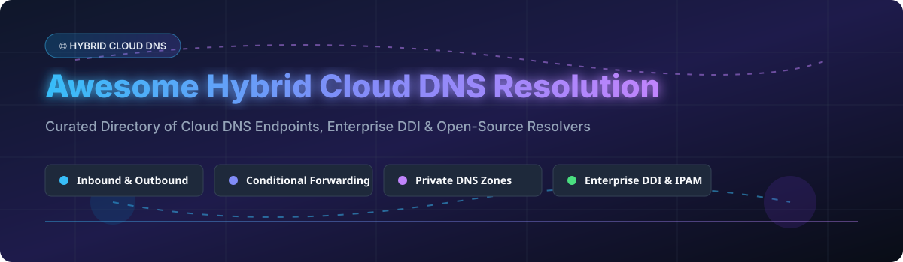

# Awesome-Hybrid-Cloud-DNS-Resolution

# Awesome-Hybrid-Cloud-DNS-Resolution 🌐 🔄

  

  
  
  
  
  
  

---

## 🌟 Top Hybrid Cloud DNS Resolution Ecosystem

**Curated List of Commercial Hybrid DNS Platforms & Open-Source DNS Resolver Tools**  
*Focused on Hybrid DNS Resolution, On-Premises to Cloud DNS Forwarding, Private DNS Zones, Conditional Forwarding, DNS Security & Self-Hosted Resolvers*

**Last updated: October 2026** 📅

---

### 📌 Overview & SEO Summary
Welcome to the ultimate curated directory of **hybrid cloud DNS resolution platforms**, **open-source DNS resolvers**, and **enterprise DDI (DNS-DHCP-IPAM) frameworks**. Whether you are looking for enterprise-grade commercial solutions (such as *Amazon Route 53 Resolver*, *Infoblox BloxOne DDI*, and *BlueCat Cloud DNS*), or self-hostable open-source alternatives (like *BIND 9*, *Unbound*, and *CoreDNS*), this list covers category leaders, conditional forwarding, and privacy-respecting hybrid DNS.

**Key Market Context:**
- **Amazon Route 53 Resolver** is the **leading hybrid DNS service**, providing **inbound and outbound endpoints** for **bidirectional DNS resolution between on-premises networks and AWS VPCs**.
- **Infoblox BloxOne DDI** is the **enterprise standard for hybrid DDI**, with **unified DNS, DHCP, and IPAM across on-premises and multi-cloud** environments.
- **BIND 9** remains the **most widely deployed open-source DNS resolver**, powering **the majority of the global DNS infrastructure** including root nameservers.

---

## 📑 Table of Contents
- [🏢 SaaS & Commercial Platforms](#-saas--commercial-platforms)
- [🔓 Open-Source GitHub Projects](#-open-source-github-projects)
- [🛠️ How to Contribute](#%EF%B8%8F-how-to-contribute)
- [📊 Star History](#-star-history)
- [🤝 Support & Sponsorship](#-support--sponsorship)
- [⚠️ Disclaimer](#%EF%B8%8F-disclaimer)

---

## 🏢 SaaS / Commercial Platforms

The hybrid cloud DNS resolution market spans **hyperscaler-native DNS services** (Amazon Route 53 Resolver, Azure Private DNS Resolver, Google Cloud DNS Peering) that provide **managed hybrid DNS with inbound/outbound endpoints**, **enterprise DDI platforms** (Infoblox, BlueCat, EfficientIP, Men&Mice) that offer **unified DNS-DHCP-IPAM across hybrid environments**, and **security-focused DNS platforms** (Cisco Umbrella, Cloudflare Gateway, NS1 Private DNS) that combine **DNS resolution with security and policy enforcement**. **Amazon Route 53 Resolver** charges **$0.125/hour per endpoint** plus **$0.40/million queries** . **Infoblox BloxOne DDI** uses **custom enterprise pricing** . **BlueCat Cloud DNS** uses **custom enterprise pricing** . **Azure Private DNS Resolver** charges **¥0.55/hour per endpoint** .

| SaaS / Commercial Platform | Company / Owner | Valuation / Market Cap | Standard Edition Starting Price | Free Tier / Free Trial Limits | Description |
| :--- | :--- | :--- | :--- | :--- | :--- |
| **[Amazon Route 53 Resolver](https://aws.amazon.com/route53/resolver/)** ☁️ | Amazon | ~$2.0 Trillion | **$0.125/hour per endpoint** + **$0.40/million queries**  | **Free tier: limited** | **AWS-native hybrid DNS** — **Inbound and outbound endpoints** for **bidirectional DNS resolution between on-premises networks and AWS VPCs** . **Resolver rules** for conditional forwarding . **DNS Firewall** for security . **The leading managed hybrid DNS service** . |
| **[Infoblox BloxOne DDI](https://www.infoblox.com/)** 🔵 | Infoblox | Private | **Custom enterprise pricing**  | **Free trial available** | **Enterprise DDI platform** — **Unified DNS, DHCP, and IPAM across on-premises and multi-cloud** . **BloxOne Threat Defense for DNS security** . **The most comprehensive hybrid DDI platform** . |
| **[BlueCat Cloud DNS](https://bluecatnetworks.com/)** 🟢 | BlueCat Networks | Private | **Custom enterprise pricing**  | **Free trial available** | **Enterprise DDI platform** — **Cloud-native DNS with hybrid integration** . **Adaptive DNS and security** . **Integration with AWS, Azure, and GCP** . |
| **[EfficientIP SOLIDserver Cloud](https://www.efficientip.com/)** 🟣 | EfficientIP | Private | **Custom enterprise pricing**  | **Free trial available** | **Enterprise DDI platform** — **SOLIDserver for hybrid DNS management** . **DNS security and automation** . |
| **[Azure Private DNS Resolver](https://azure.microsoft.com/en-us/products/dns/)** 🔷 | Microsoft | ~$3.90 Trillion | **¥0.55/hour per endpoint**  | **Free tier: limited** | **Azure-native hybrid DNS** — **Inbound and outbound endpoints** for **hybrid DNS resolution** . **Forwarding rulesets** for conditional forwarding . **Integration with Azure Private DNS Zones** . |
| **[Google Cloud DNS Peering](https://cloud.google.com/dns/docs/zones)** 🌐 | Google (Alphabet) | ~$2.0 Trillion | **$0.20/zone/month** + **$0.40/million queries**  | **$300 free credits** | **GCP-native hybrid DNS** — **DNS peering across VPC networks** . **Forwarding zones for on-premises integration** . **Cloud DNS for hybrid resolution** . |
| **[Men&Mice DDI Suite](https://www.menandmice.com/)** 🟠 | Men&Mice | Private | **Custom enterprise pricing**  | **Free trial available** | **DDI management platform** — **Multi-vendor DNS, DHCP, and IPAM management** . **Overlay for hybrid cloud DNS** . |
| **[NS1 Private DNS](https://ns1.com/)** 🟡 | IBM (NS1) | ~$200 Billion (IBM) | **$113.85/month** (Essentials)  | **Trial available** | **Private DNS and traffic steering** — **Hybrid DNS resolution with advanced routing** . **Pulsar for RUM-based steering** . **Dedicated DNS for custom nameservers** . |
| **[Cisco Umbrella Roaming](https://umbrella.cisco.com/)** 🔴 | Cisco | ~$200 Billion | **Custom enterprise pricing**  | **Free tier: limited** | **DNS-layer security** — **Cloud-delivered DNS security and resolution** . **Roaming client for remote users** . **The most widely deployed DNS security platform** . |
| **[Cloudflare Gateway DNS](https://www.cloudflare.com/zero-trust/products/gateway/)** 🟢 | Cloudflare Inc. | ~$30 Billion | **$5/user/month** (Zero Trust) | **Free: up to 50 users**  | **Zero Trust DNS resolution** — **DNS filtering and security** . **Cloud-native hybrid DNS** . **The most accessible DNS security platform** . |

---

## 🔓 Open-Source GitHub Projects

*Sorted by GitHub_Stars_Count (Descending)* 🌟

- **[BIND 9](https://github.com/isc-projects/bind9)**   
  **The most widely deployed DNS server on the internet**, MPL-2.0 licensed. **Mirror of ISC GitLab repository** . **Authoritative and recursive DNS** . **DNSSEC support, views, ACLs, and response policy zones (RPZ)** . **Conditional forwarding for hybrid DNS** . **The reference implementation** for DNS protocol standards . **The definitive open-source DNS resolver** . 🏛️

- **[Unbound](https://github.com/NLnetLabs/unbound)**   
  **Validating, recursive, and caching DNS resolver**, BSD-3-Clause licensed. **The most secure open-source recursive resolver** . **DNSSEC validation** . **DNS-over-TLS (DoT) and DNS-over-HTTPS (DoH) support** . **The standard for privacy-focused recursive DNS** . 🔒

- **[CoreDNS](https://github.com/coredns/coredns)**   
  **DNS server that chains plugins**, Apache-2.0 licensed. **The default DNS server for Kubernetes** . **Plugin-based architecture for hybrid DNS** . **Conditional forwarding and caching** . **The most widely deployed cloud-native DNS server** . ☸️

- **[Knot Resolver](https://github.com/CZ-NIC/knot-resolver)**   
  **Caching full DNS resolver**, GPL-3.0 licensed. **High-performance, DNSSEC-validating resolver** . **Lua scripting for custom resolution policies** . **The most performant open-source resolver** . ⚡

- **[PowerDNS Recursor](https://github.com/PowerDNS/pdns)**   
  **High-performance DNS recursor**, GPL-2.0 licensed. **The most scalable open-source resolver** . **Lua scripting for custom resolution** . **DNS-over-TLS and DNS-over-HTTPS** . **Used by large ISPs and enterprises** . 🚀

- **[dnsmasq](https://github.com/imp/dnsmasq)**   
  **Lightweight DNS forwarder and DHCP server**, GPL-2.0/GPL-3.0 licensed. **The most widely deployed DNS forwarder** . **DHCP, DNS, and TFTP in one small package** . **The standard for home routers and small networks** . 🏠

- **[Pi-hole](https://github.com/pi-hole/pi-hole)**   
  **Network-wide ad blocking via DNS**, EUPL-1.2 licensed. **DNS sinkhole for ad and tracker blocking** . **Conditional forwarding for hybrid DNS** . **The most popular self-hosted DNS management tool** . 🕳️

- **[AdGuard Home](https://github.com/AdguardTeam/AdGuardHome)**   
  **User-friendly ads and trackers blocking DNS server**, GPL-3.0 licensed. **Network-wide ad blocking with a polished web interface** . **DNS-over-HTTPS and DNS-over-TLS upstream support** . **Parental controls and safe search** . 🚫

- **[Blocky](https://github.com/0xERR0R/blocky)**   
  **Fast and lightweight DNS proxy as ad-blocker**, Apache-2.0 licensed. **Alternative to Pi-hole with a focus on performance** . **DNS-over-HTTPS, DNS-over-TLS, and DNSCrypt support** . **Conditional forwarding for split DNS** . 🚀

- **[Technitium DNS Server](https://github.com/TechnitiumSoftware/DnsServer)**   
  **Authoritative and recursive DNS server with ad blocking**, open-source. **Self-hosted alternative to Pi-hole** with both authoritative and recursive capabilities . **Web-based management console** . **Blocklist support for ad and tracker blocking** . 🛡️

- **[Gravity](https://github.com/BeryJu/gravity)**   
  **Fully-replicated DNS and DHCP Server with ad-blocking powered by etcd**, open-source. **High availability through etcd replication** . **Combined DNS and DHCP** in a single service . **The most resilient self-hosted DNS solution** . 🌐

- **[coredns-tailscale](https://github.com/tailscale/coredns-tailscale)**   
  **CoreDNS plugin for Tailscale**, BSD-3-Clause licensed. **Resolves Tailscale MagicDNS names** . **The standard for hybrid DNS with Tailscale** . 🔗

---

## 🛠️ How to Contribute

Contributions are welcome! Follow these steps to submit new hybrid DNS platforms or open-source DNS resolver software:

1. 🍴 **Fork** the repository.
2. 📝 **Add/edit** entries in `README.md` maintaining table/list structure and formatting.
3. 🔗 Include project title, official website/GitHub link, exact Stars_Count, license, and brief description.
4. 🚀 Submit a **Pull Request** with a descriptive summary of your changes.

---

## 📊 Star History

---

## 🤝 Support & Sponsorship

If you find this hybrid cloud DNS resolution repository useful, please consider supporting the project:

- ⭐ **Star** this repository to increase visibility!
- 🔀 **Fork** and share with fellow network engineers, cloud architects, and open-source advocates.
- ☕ **Sponsor & Buy Me a Coffee**: Support ongoing open-source curation via the [GitHub Sponsor Dashboard](https://github.com/sponsors/ishandutta2007).

---

## ⚠️ Disclaimer

- This is a **community-curated** list — not exhaustive and not an endorsement. ℹ️
- **Amazon Route 53 Resolver is the leading managed hybrid DNS service** — **$0.125/hour per endpoint** plus **$0.40/million queries** . **Azure Private DNS Resolver charges ¥0.55/hour per endpoint** . **Infoblox BloxOne DDI uses custom enterprise pricing** .
- **BIND 9 is the most widely deployed open-source DNS server** — powers the **majority of the global DNS infrastructure** including root nameservers . **Unbound is the most secure recursive resolver** with **DNSSEC validation and DoT/DoH support** .
- **Open-source DNS resolvers are not turnkey** — they require **deployment, DNSSEC key management, and ongoing maintenance** . **BIND 9 requires zone configuration and DNSSEC signing** . **Unbound requires root trust anchor management** . **Always validate resolution correctness and DNSSEC validation with a proof-of-concept** before production deployment . 🌐

---

  <b>Made with ❤️ for network engineers, cloud architects, and open-source DNS advocates.</b>

